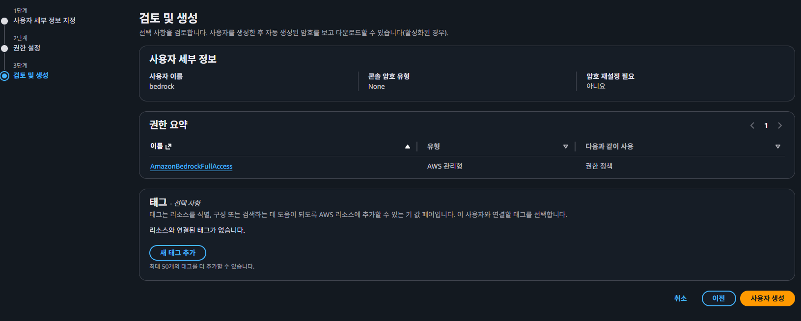
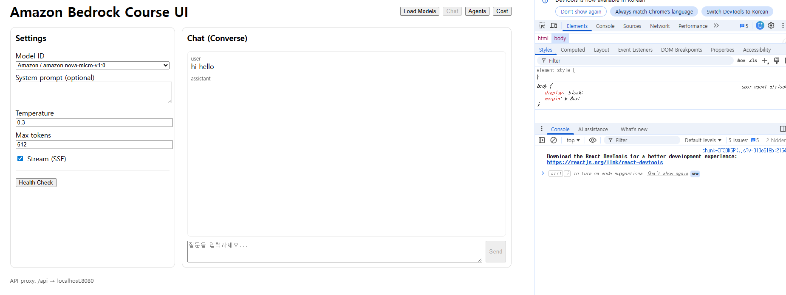
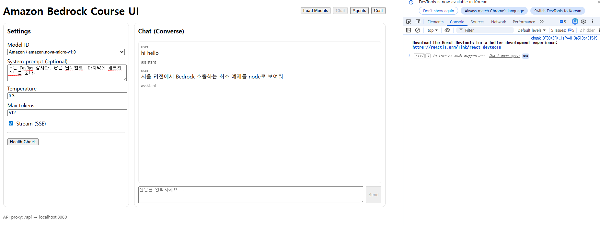

# Amazon Bedrock Course Starter (Node.js + React)

이 레포는 **Amazon Bedrock 입문/실습/강의용**으로 바로 실행 가능한 예제(백엔드 + 프론트엔드)를 제공합니다.

- 백엔드: Node.js(Express) — Bedrock Runtime(Converse/ConverseStream), Bedrock(모델 목록), Agent Runtime(RAG)
- 프론트엔드: React(Vite) — 모델 선택, 채팅/스트리밍, RAG 질의 UI

> ⚠️ Bedrock 사용 전, AWS 콘솔에서 **Model access**(모델 사용 권한)을 활성화해야 합니다.
> 또한 리전에 따라 사용 가능한 모델이 다릅니다.

---

## 0) Prerequisites

- Node.js 18+ (권장 20+)
- AWS 계정 + Bedrock 사용 권한
- AWS CLI 로그인(권장)
  - `aws configure` 또는 SSO/프로파일 사용

---




## 1) 빠른 시작

### 1-1. 환경 변수
```bash
cp apps/api/.env.example apps/api/.env
```

`apps/api/.env` 예시 (서울 리전 기준):
- `AWS_REGION=ap-northeast-2  # Seoul`
- (선택) `AWS_PROFILE=devuser`
- (선택) `ALLOWED_ORIGINS=http://localhost:5173`

### 1-2. 설치 & 개발 실행
```bash
npm install
npm run dev
```

- API: http://localhost:8080
- Web: http://localhost:5173

---



```
1) Chat 탭 사용법 (지금 화면 그대로)

Model ID 선택

지금처럼 amazon.nova-micro-v1:0 선택하면 됨 (가볍고 실습용으로 좋아요)

(선택) System prompt

예:

너는 DevOps 강사다. 답은 단계별로, 마지막에 체크리스트를 준다.


Temperature

0.0~0.3: 안정/정확

0.7+: 창의/다양 (실습용이면 0.2~0.4 추천)

Max tokens

응답 길이 제한입니다. 길게 나오면 비용도 늘어서, 실습은 256~512가 무난.

Stream(SSE) 체크 여부

체크: 답이 “타이핑”되듯 실시간 출력

해제: 한 번에 응답 완성본만 받음

오른쪽 아래 입력칸에 질문 → Send

예: hi hello 말고 아래 같은 걸 추천

서울 리전에서 Bedrock 호출하는 최소 예제를 node로 보여줘

EKS에서 ALB ingress 설치 순서 알려줘
```



## 2) 실습(랩) 가이드

`/labs` 폴더에 실습 시나리오가 들어 있습니다.

- Lab 01: Bedrock 개요 & 모델 목록 확인
- Lab 02: Converse로 채팅 만들기
- Lab 03: ConverseStream(SSE)로 스트리밍 채팅
- Lab 04: 안전장치(가드레일) 붙이기 (설명 + 확장 과제)
- Lab 05: Knowledge Bases 기반 RAG (RetrieveAndGenerate)
- Lab 06: 운영(비용/로깅/레이트리밋) & 배포(옵션)

---

## 3) IAM 권한 (학습용 최소 예시)

> 실제 운영에서는 최소권한 + 조건(리전, 모델, VPC 엔드포인트 등)을 더 강하게 권장합니다.

`apps/api/iam/policy-example.json` 참고.

---

## 4) 트러블슈팅

### 4-1. AccessDenied / model not enabled
- Bedrock 콘솔에서 **Model access** 활성화 여부 확인
- 리전(`AWS_REGION`)에서 해당 모델이 지원되는지 확인

### 4-2. CORS 문제
- `ALLOWED_ORIGINS`에 프론트 주소 추가
- 또는 개발 중에는 `*` 허용(비권장)

---

## 5) 라이선스
MIT


---

## 2-1) Bedrock Agents 실습 준비(서울 리전)

이 레포는 **Agents for Amazon Bedrock 런타임 Invoke**까지 포함합니다. (서울 `ap-northeast-2` 지원)  
- Agents 지원 리전 목록에 `ap-northeast-2`가 포함됩니다.  
- Invoke는 **Agents Runtime endpoint**로 호출합니다.  

실습 순서(권장):
1) 콘솔에서 Agent 생성 (Foundation model 선택)
2) (선택) Knowledge Base 연결 또는 Action group(Lambda) 연결
3) Agent Alias 생성(예: `dev`) → **aliasId 확인**
4) 아래 엔드포인트로 호출
   - `POST /api/agent/invoke`
   - `POST /api/agent/stream` (SSE 스트리밍)

환경변수(선택):
- `AGENT_ID` / `AGENT_ALIAS_ID`를 `.env`에 넣어두면, 프론트에서 기본값으로 자동 세팅되게 확장할 수 있습니다.


---

## 2-2) 비용 계산기(Cost 탭)

프론트의 **Cost 탭**에서 아래를 바로 계산할 수 있습니다.
- 요청당/기간별 LLM 비용(입력/출력 토큰 기반)
- (옵션) Guardrails 비용(text units 기반)

실습 문서: `labs/08_cost_calculator.md`


---

## 2-3) 실제 usage 기반 비용 추정(자동)

백엔드가 최근 호출의 **input/output tokens**를 메모리에 기록하고, 프론트의 Cost 탭에서:
- 최근 N회 평균 토큰
- 단가를 적용한 평균 비용/기간 비용

을 자동으로 계산해줍니다.

API:
- `GET /api/usage/recent?limit=50`
- `GET /api/usage/summary?limit=100`

실습 문서: `labs/09_usage_based_cost.md`


---

## Troubleshooting
- `labs/00_troubleshooting.md` 참고
